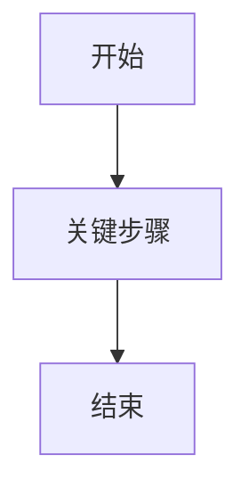

# PRD 模板

使用此模板生成可评审的中文 PRD。文档应简洁、具体，并可追溯到已确认的业务模型。

## 1. 背景与目标

- 背景：
- 目标：
- 非目标：
- 成功标准：

## 2. 用户与场景

- 目标用户：
- 主要角色：
- 使用场景：
- 关键痛点：

## 3. 范围

- 本期范围：
- 暂不包含：
- 依赖与前置条件：

## 4. 业务对象与状态

| 业务对象 | 关键属性 | 状态 | 状态说明 |
| --- | --- | --- | --- |

## 5. 业务规则

| 编号 | 规则 | 触发条件 | 结果 | 备注 |
| --- | --- | --- | --- | --- |

## 6. 主流程

用编号步骤描述从入口到完成的完整主路径。每一步写清楚参与角色、系统行为、用户操作和状态变化。

## 7. 异常与分支流程

| 场景 | 触发条件 | 系统表现 | 用户可执行动作 | 状态变化 |
| --- | --- | --- | --- | --- |

## 8. 页面与交互要求

| 页面/模块 | 目标 | 主要内容 | 关键操作 | 状态/反馈 |
| --- | --- | --- | --- | --- |

## 9. 权限与可见性

| 角色 | 可见内容 | 可执行操作 | 限制 |
| --- | --- | --- | --- |

## 10. 验收标准

- 

## 11. 风险与待确认问题

- 风险：
- 待确认：

## 12. 流程图

使用 Mermaid。

